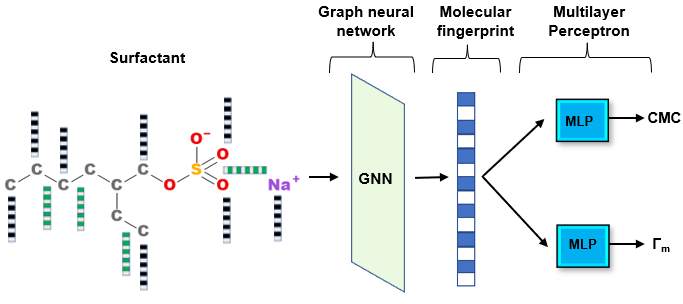

# Graph Neural Networks for Surfactant Multi-Property Prediction
This is the source code for the paper: [Graph Neural Networks for Surfactant Multi-Property Prediction](https://www.sciencedirect.com/science/article/pii/S0927775724009944)
# Graphical abstract 


# Data
The test data set used in this work is provided open-source. The training data can be made available upon request.

# Code
* **model_single_task**: Python code for single-task model training.
* **model_multi_task**: Python code for multi-task model training.
* **smiles_to_graphs**: Python code for generating molecular graphs from SMILES strings to be used in single-task training.
* **smiles_to_graphs_ml**: Python code for generating molecular graphs from SMILES strings to be used in multi-task training.

# Citation

You can cite this work with the following .bib entry:
```
@Article{Brozos2024,
  author   = {Christoforos Brozos and Jan G. Rittig and Sandip Bhattacharya and Elie Akanny and Christina Kohlmann and Alexander Mitsos},
  journal  = {Colloids and Surfaces A: Physicochemical and Engineering Aspects},
  title    = {Graph neural networks for surfactant multi-property prediction},
  year     = {2024},
  issn     = {0927-7757},
  pages    = {134133},
  volume   = {694},
  doi      = {https://doi.org/10.1016/j.colsurfa.2024.134133},
  keywords = {Surfactants, Critical micelle concentration, Surface excess concentration, Graph neural network, Multi-task learning},
}
```
